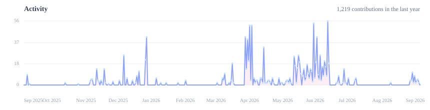

<em>疏影横斜水清浅，暗香浮动月黄昏。</em>

  
  
  

<!-- Banner slot reserved for a future narrow illustration or custom header -->

---

## About Me

> I am QianYan, someone who enjoys turning small sparks of inspiration into finished work.  
> More than adding flashy features, I care about whether a project has its own rhythm, structure, and aftertaste.

- 🎓 Transportation Engineering undergrad at **Zhengzhou University**, self-taught into AI engineering since 2024
- 🚦 Led **SafetyRAISE** — a provincial-level innovation project — from idea to deployment: 2 invention patents filed, and a handful of front-line traffic officers using it for real
- 🦀 Wrote a **Qwen3 inference engine from scratch in Rust**, because I wanted to know what actually happens below the API
- 🛠️ Comfortable across the whole line — fine-tuning, RAG, agent workflows, full-stack, and the servers it all runs on

## Now

- 📄 Writing the SafetyRAISE work up into a paper — draft done, revising the experiments
- ⚙️ Keeping the deployed system alive and iterating on the retrieval side
- 🦀 Pushing `rsinfer` further: quantization, GPU offload, and honest benchmarks against llama.cpp
- 🎐 Still drawn to things where logic and imagination can stand side by side

## Featured Projects

### [SafetyRAISE-OS](https://github.com/QianYan-Art/SafetyRAISE-OS) 

`React` `FastAPI` `Agentic RAG` `YOLO + ByteTrack`

A road-traffic accident analysis and report generation system. It carries accident photos and videos through a full pipeline — structured accident info, expert guidance, retrieval-augmented analysis, and exportable documents — with a YOLO + ByteTrack video path and per-user model configuration, built for local debugging, private deployment, and secondary development.

Built as a provincial innovation project I led end to end: **expert-small-model + LLM architecture**, a fine-tuned Qwen3-4B producing structured analysis checklists that guide the larger model through alternating retrieval. Two invention patents filed, one software copyright pending, deployed and still running.

### [SafetyRAISE-LMEngine](https://github.com/QianYan-Art/SafetyRAISE-LMEngine) 

`Rust` `LLM Inference`

A minimal large-model inference engine written from scratch in Rust (crate `rsinfer`), tuned for a fine-tuned Qwen3-4B-Thinking and serving as the expert small model behind SafetyRAISE. It reimplements every stage of transformer inference — weight loading, tensor ops, GQA, QK-Norm, RoPE, SwiGLU, KV cache, sampling — in readable code.

Row-wise Q8 quantization with a hybrid CPU/GPU resident-decode path (30 transformer layers offloaded): **measured decode median 58.9 → 44.1 ms/token, +25% in A/B**, ~7.0 GiB VRAM peak. Built for understanding rather than for beating `llama.cpp` — the benchmarks against it are in the README, including where it still loses.

### [maintenance](https://github.com/QianYan-Art/maintenance) 

`Rust` `CLI` `Docs`

A lightweight CLI and agent skill that keeps project documentation in sync with code changes. Instead of letting a model reread every doc and guess, it extracts changed tokens from a diff, flags stale and missing lines, and hands a read-only subagent the exact paths to review — running entirely locally with no API, secrets, or background service.

## On Hugging Face

- [**TS-Dataset**](https://huggingface.co/datasets/suyuan37/TS-Dataset) — SFT + DPO Chinese corpus for traffic-accident analysis, built from scratch across five categories (10K–100K rows, MIT)
- [**SafetyRAISE-TS-Qwen3**](https://huggingface.co/suyuan37/SafetyRAISE-TS-Qwen3) — the fine-tuned expert small model behind SafetyRAISE

Around **550 downloads** between them so far.

<!-- Illustration slot reserved for a future transition image -->

## Activity

  

---

  

